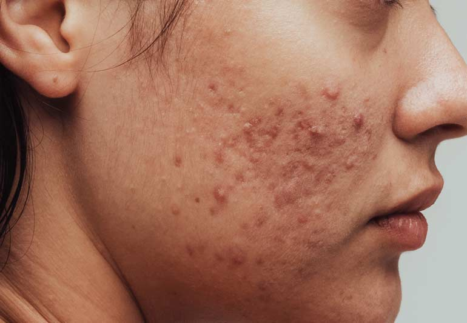

# IBM-Project_Skin_Disease_Prediction

# Inspiration

This project is mainly aimed at detecting various known skin diseases that affect millions of people worldwide, impacting their health both physically and mentally. While dermatologists perform many manual diagnoses, identifying diseases can be time-consuming, especially in remote areas with a shortage of healthcare professionals. This project aims to raise awareness of skin diseases and provide timely assistance.

# What it does

In remote areas where there is a shortage of healthcare professionals, and where people might not be aware of certain skin diseases, manual diagnoses can be slow. To address this issue, an "Automated Skin Disease Diagnosis System" has been developed. This system provides faster and more accurate information on skin diseases to end users.

# How we built it

A dataset was collected from The International Skin Imaging Collaboration (ISIC) and further preprocessed for classification. A deep learning model using Convolutional Neural Networks (CNNs) was then created. The model is trained on a dataset of more than 18,000 images, categorized by various skin diseases. Each categorized class corresponds to a specific skin disease condition, such as melanoma, nevus, or psoriasis.

# Accomplishments that we're proud of

- Improved self-diagnosis and progressive medications/consultations for people in rural areas.
- The model can predict the specific skin disease affecting the user.
- Provides valuable alternative diagnoses, making it a significant tool in dermatology.
- Supports early detection and treatment of skin diseases, enhancing patient outcomes and reducing the burden of skin-related health issues.

# Future Factors

In the future, the model may provide medication suggestions for users to treat their conditions. The medication data is under process, and further clarification from dermatologists is needed to instruct medications in real time.

# Built With
- CSS
- Deep Learning
- HTML
- ISIC Dataset
- Neural Networks
- Python

## Input:

  

## Output:

